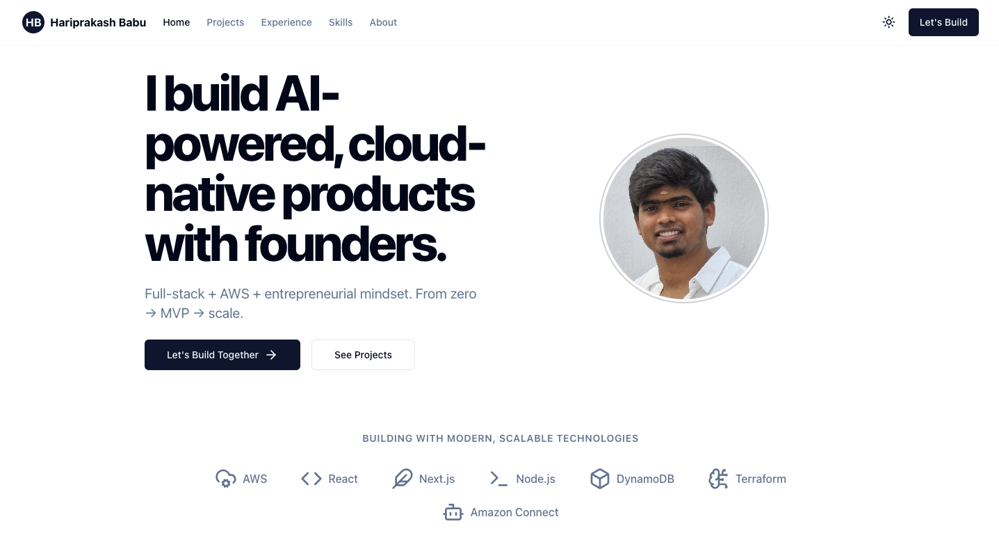

<div align="center">
  
</div>

# Hariprakash Babu – Portfolio

Welcome to my portfolio repository!  
This repo contains the source code and setup instructions for my personal portfolio site, where I showcase my work, projects, and experience as a **Full Stack & Cloud Engineer**.

🔗 **Live Portfolio**: [View Here](https://devharipragaz007.github.io/)  
🔗 **LinkedIn**: [linkedin.com/in/haripragaz](https://www.linkedin.com/in/haripragaz/)

---

## 🚀 About Me

I’m a **Lead Software Engineer** with 6+ years of experience building scalable web applications, designing cloud-native systems, and leading engineering teams.  
I specialize in **JavaScript/TypeScript, React, Node.js, AWS, and Microservices**, with hands-on expertise in modern front-end frameworks and backend systems.  

I enjoy solving complex problems, optimizing systems for performance and scalability, and experimenting with emerging AI-driven solutions.

---

## 🛠️ Tech Stack

- **Frontend**: React, Next.js, Redux, Angular, Vue.js, TypeScript, JavaScript  
- **Backend**: Node.js, Express.js, Python (Flask), Java Spring Boot, PHP (CodeIgniter)  
- **Databases**: PostgreSQL, MySQL, MongoDB, AWS DynamoDB, SQL Server  
- **Cloud & DevOps**: AWS (Lambda, S3, DynamoDB, Connect, QuickSight), Terraform, Docker, Kubernetes  
- **Other**: Microservices, REST APIs, Unit Testing (Jest, RTL, Jasmine), Agile/Scrum  

---

## 📂 Projects

Here are some featured projects (more on my [portfolio site](https://devharipragaz007.github.io/)):

- **Petco – Amazon Connect Optimization**  
  Built & optimized 50+ Amazon Connect flows with AWS Lambda, DynamoDB, S3, and QuickSight, reducing call handling time by 20%.  

- **Custom CCP for Amazon Connect**  
  Designed and implemented a custom Contact Control Panel in Angular, improving agent productivity by 25%.  

- **DataTwin Platforms (TCS & OneIntegral)**  
  Developed large-scale reconciliation & performance platforms using React, Node.js, AWS services, and Terraform, improving automation and scalability.  

- **ERP & Automation Systems (Global Software Solutions)**  
  Delivered ERP and automation solutions with AngularJS, PHP, and MySQL, improving efficiency by 30%.  

---

## 🖥️ Run Locally

**Prerequisites:** Node.js  

1. Clone the repo  
   ```bash
   git clone https://github.com/<your-username>/hariprakash-portfolio.git
   cd hariprakash-portfolio
